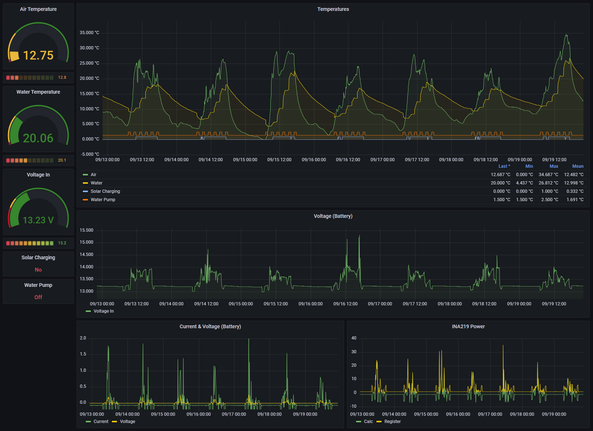

# greenhouse-hyrdoponics
An experiment in automation.


<br/>
<br/>


# Background Information on Device Configuration

**Device:** Raspberry Pi Zero 2 W

**OS:** Raspberry Pi OS Lite (32-bit), released 2022-04-04. A port of Debian Bullseye with no desktop environment.
</br>

_Note: The following assume a headless instance of the Raspberry Pi OS and so the following notes only refer to driving changes through the command line or `config.txt` file._
</br></br>
## 1-Wire (W1) Protocol
By default the Raspberry Pi OS disables the 1-Wire interface. To use sensors such as the DS1820 we need to re-enable it.

To enable the interface modify the `config.txt`:
``` bash
sudo nano /boot/config.txt
```

Add the following after the last line in the file:

``` bash
dtoverlay=w1-gpio
```
_The default BCM4 is 4._
</br>
</br>
To activate the protocol on one or more custom pins use:
``` bash
dtoverlay=w1-gpio,gpiopin=4
dtoverlay=w1-gpio,gpiopin=24
```
Then reboot the Pi for the changes to take effect, `sudo reboot`.

Run the following commands to pick up the attached 1-Wire temperature sensors:
``` bash
sudo modprobe w1-gpio
sudo modprobe q1-therm
```

Run the following to list the found devices:
``` bash
ls /sys/bus/w1/devices/
```
</br>

## Reducing Power Consumption
Initially developed on the RPi 3b+ it was quite power hungry and the following were useful to reduce device power usage by a new milliamps.
The setup is now running on a Pi Zero 2 which has a lower overall power consumption.

### Disable on board Bluetooth
List Bluetooth devices by running:
``` bash
hciconfig
```
If you have any onboard or connected chips you will see output similar to the following:
```
hci0:   Type: Primary  Bus: UART
        BD Address: B8:27:EB:72:17:A5  ACL MTU: 1021:8  SCO MTU: 64:1
        UP RUNNING 
        RX bytes:1562 acl:0 sco:0 events:96 errors:0
        TX bytes:2574 acl:0 sco:0 commands:96 errors:0
```
_Note: In this example the device is `UP`._

You can see the list of available `hciconfig` options by running `hciconfig -h`, for our purposes we are focusing on the `up` and `down` arguments.

To disble the Bluetooth device run the following, using the desired `up/down` state and device id, e.g.
``` bash
sudo hciconfig hci0 down
```
</br>

###  Disable on board LEDs
The following settings when added to the `config.txt` will disable the Power, Activity and Network activity LEDs. Reboot after applying these to have them take effect.

``` bash
# Turn off Power LED
dtparam=pwr_led_trigger=none
dtparam=pwr_led_activelow=off
# Turn off Activity LED
dtparam=act_led_trigger=none
dtparam=act_led_activelow=off
# Turn off Ethernet ACT LED
dtparam=eth_led0=14
# Turn off Ethernet LNK LED
dtparam=eth_led1=14
```
_Note: These work for the RPi 3, but the Pi 4 'eth' ids are different._
</br></br>

## Acknowledgements
- 1-Wire configuration: https://www.raspberrypi-spy.co.uk/2018/02/enable-1-wire-interface-raspberry-pi/
- Onboard LED configuration: https://smarthomescene.com/guides/how-to-disable-leds-on-raspberry-pi-3b-4b/
- INA219 Setup: https://pypi.org/project/pi-ina219/
- Power Consumption Benchmarks: http://www.pidramble.com/wiki/benchmarks/power-consumption
